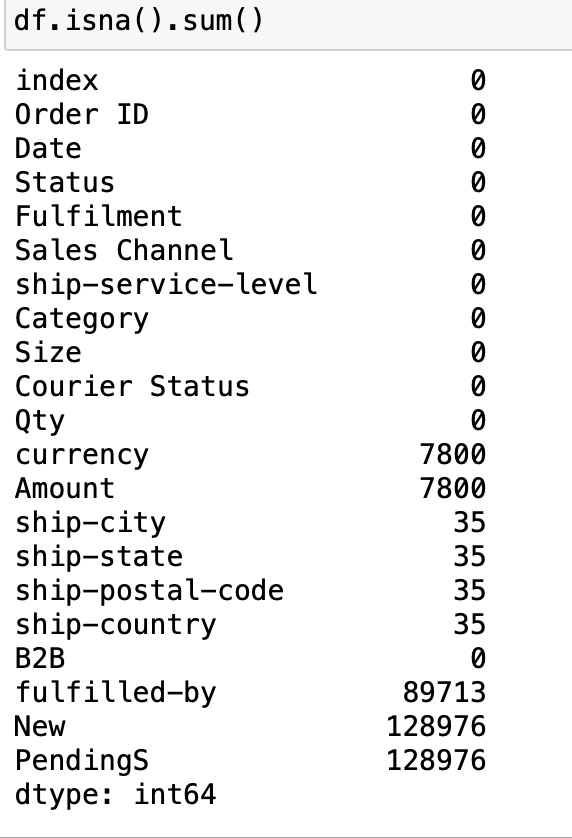
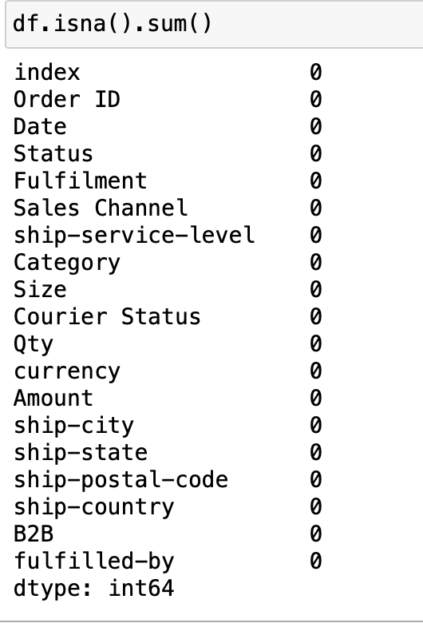
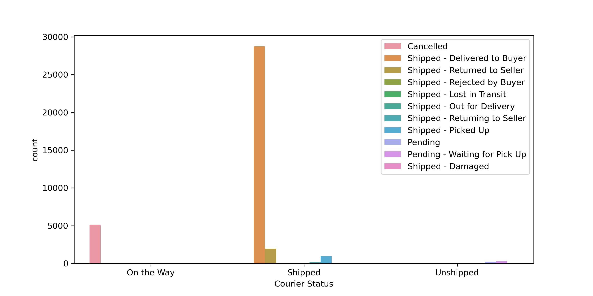
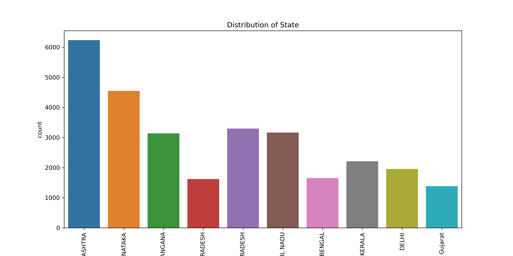

# Amazon-sales-Report.

---

### INTRODUCTION.
In today's dynamic business landscape, understanding and leveraging sales data has become more critical than ever. A comprehensive sales analysis provides invaluable insights into consumer behavior, market trends, and the performance of your products or services. By delving deep into the wealth of information hidden within your sales data, you can unlock the key to optimizing your strategies, enhancing profitability, and achieving sustainable growth. In this report, we will embark on a journey to unravel the mysteries behind your sales figures, empowering you to make informed decisions that will propel your business forward. So, fasten your seatbelts as we embark on this exciting exploration into the realm of sales analysis!

---
---

### Problem Statement.
A forensic detailed analysis was carried out on a company in india, this company needed to build an headquarter in india, My team and I Were entrusted with the task of predicting the best location(i.e city) for the headquarter. 

After critical thoughts, some questions needed an answer:
 - Where is The best Location to build an Headquarters?
 - What are the most bought Size?
 - Which city or cities should we invest in more?
 - How do we encourage sales generally?

---

### Data Sourcing.
Data were extracted from the excel work sheet into the Jupyter note using the Python's pandas library.
Data was normalised; that is,the information were categorically separated into different colums.

---

### DATA CLEANING AND TRANSFORMATION
The basic data cleaning process involves Remove Duplicates, Handling missing values,outlier detection and handling,data type conversion and normalisation standardisation. Data cleaning was performed per column. The Data set appeared to be clean. The quality of each column is 100% with no error or nulls. Below is a preview of the data set before and after the data cleaning opreations:

Dirty Data sets|Clean Data Sets 
:---------------|---------------:
|

---

### Data Analysis and Visualisation.

Analysis were done using different analytical skills while Exploratory Data and Visualisation were carried with the Python's Seaborn and matplotlib libraries respectively.
---

      

---

---

### Conclusion and recommendations.
 - The city of **MAHARASHTRA** is the best location to build the office Headquarters.
 - Varieties of **Colors** and  **Designs** on the **M** sizes and **L** Sizes should be produce as these are the most sold out Sizes.
 - Discount/ Sales should be done on **M** and **L** sizes respectively to encourage sales.
 - The cities of **MAHARASHTRA** And **KARNATAKA** should be consider first in terms of **New products** and **Discounts** as these are the  cities with the highest sales record.
 - Free shipping should be given to the cities with low shippment to encourage them to buy more.

---   

###### My goal is to provide value to the stakeholders and not just to build reports and dashboard.

# Thank You 🥰

